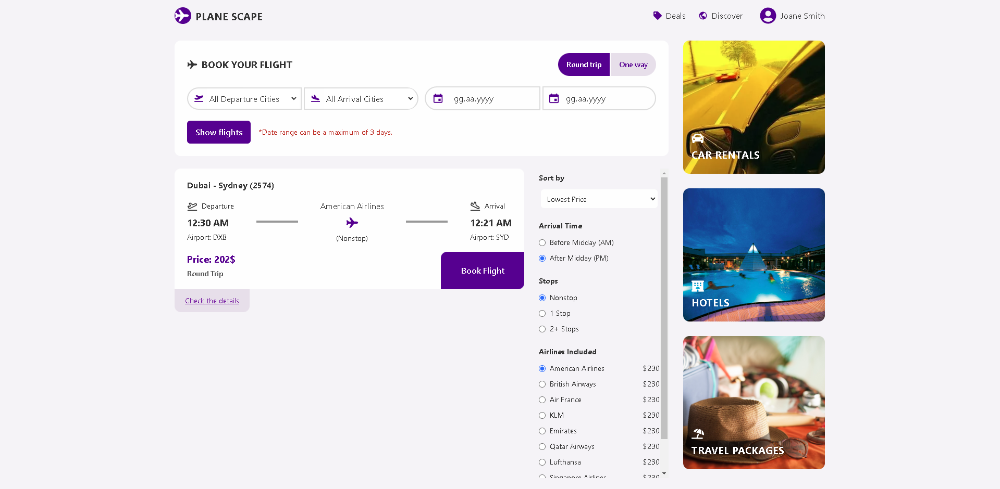

# Flight-App

## Live Demo

You can access the live version of the application hosted on AWS here:  
[Live Application](https://main.d33s06vbc0eq3q.amplifyapp.com/)

## Overview

This Flight Application allows users to search for flights based on their **desired city**, **date range**, and **trip type** (round-trip or one-way). Users can filter available flights by **arrival time**, **stops** and **airline**, sort by price or departure and book the most suitable option. Once booked, users can view their flights in their profile, sorted by departure time.

### Key Features

- **Search Flights**: Users can search for flights with filters like date range, cities, round-trip/one-way, etc.
- **Book Flights**: Users can book flights and view their bookings in their profile.
- **Flight Details**: View important flight details such as:
  - Departure and Arrival Time
  - Airline
  - Flight Code and Name
  - Airport Information
  - Visa Requirements
  - Belts
  - Price
  - Stops
  - Round-trip or One-way status
- **Profile**: View booked flights in order, ensuring past flights or already booked flights cannot be re-booked.

## Tech Stack

- **Frontend**: 
  - [React](https://reactjs.org/) with [Next.js](https://nextjs.org/) for the user interface
  - [Tailwind CSS](https://tailwindcss.com/) for styling
- **Backend**: 
  - [Node.js](https://nodejs.org/) with [Express](https://expressjs.com/) for API creation
  - [MongoDB](https://www.mongodb.com/) for database
- **API Integration**: 
  - Schiphol Flight API for real-time flight data
- **Deployment**: 
  - [AWS](https://aws.amazon.com/) for cloud hosting
  - [Docker](https://www.docker.com/) for containerization

## Screenshots

Here are a few screenshots of the working application:




## Installation

### Prerequisites

- [Node.js](https://nodejs.org/) v14+ 
- [Docker](https://www.docker.com/) (optional, for Docker installation)

### Local Setup (With Docker)

```bash
git clone https://github.com/bberkaykarademir/flight-app.git
cd flight-app
docker-compose up --build
```
Open [http://localhost:3000](http://localhost:3000) with your browser to see the result.

### Local Setup (Without Docker)

```bash
git clone https://github.com/bberkaykarademir/flight-app.git
cd flight-app
cd client
npm install
npm run dev
```
Open [http://localhost:3000](http://localhost:3000) with your browser to see the result.

And if you want to check out the server(not required for installation)
```bash
cd flight-app
cd server
npm install
npm run dev
```

## Tech Notes

- The Schiphol Flight API was not sufficient for the UI's filters and flight data, so I integrated it with my `GET /flights` API to enrich the data and expand the filter options.
- The `.env` file was removed from `.gitignore` for easier sharing.